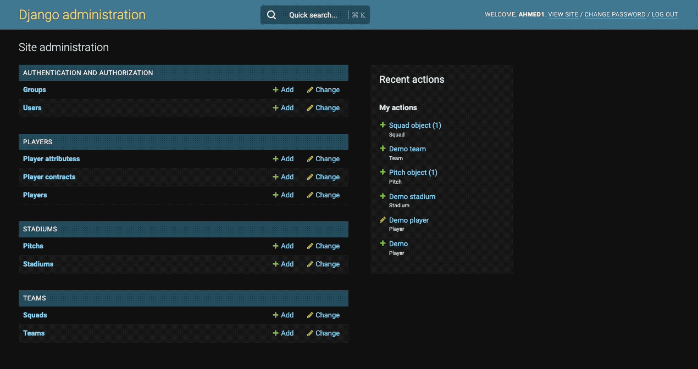
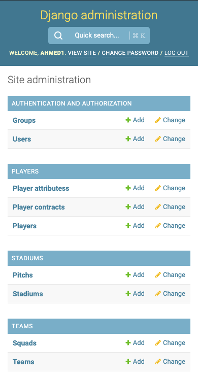
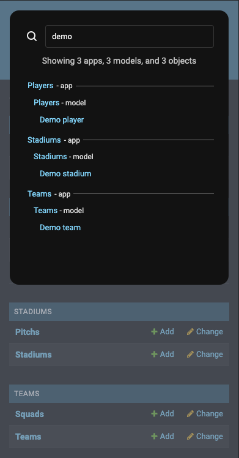

# django-admin-site-search

A global/site search modal for the Django admin.

## Features

- 🎩 Works out-of-the-box, with minimal config.
- 🔎 Search performed on:
  - App labels.
  - Model labels and fields.
  - Object Char and Text fields (with `__icontains`).
- 🔒 Built-in auth: users can only search apps and models that they have permission to view.
- ⚡ Results appear on-type, with throttling/debouncing to avoid excessive requests.
- 🎹 Keyboard navigation (cmd+k, up/down, enter).
- ✨ Responsive, and supports dark/light mode.
  - Built-in CSS vars used to match your admin theme.

## Requirements

- Python 3.8 - 3.11.
- Django 4.0 - 4.1.

## Installation

TODO

## Screenshots

  
   

